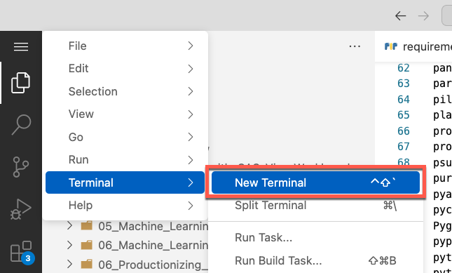

# Installing Required Python Libraries

*Note: if using JupyterLab, right-click on this document and select `Show Markdown Preview` to view this file.*

To install the Python libraries required for this project, follow these instructions. It has to be done only one time.

*Note: These instructions assume you are using SAS Viya Workbench, but you can adjust them in any supported Python environment.*

- If using VS Code, open the VS Code menu and select **Terminal** > **New Terminal**:



- If using JupyterLab, go to the **Launcher** tab, double-click **Terminal** in the **Other** pane:


- Run the following commands (assuming you cloned the `sas-education` repository at the root of your Workbench mount folder)

```shell
cd $WORKSPACE/sas-education/sas1
pip install -r python/requirements.txt
```

- Restart your Python kernel if applicable
